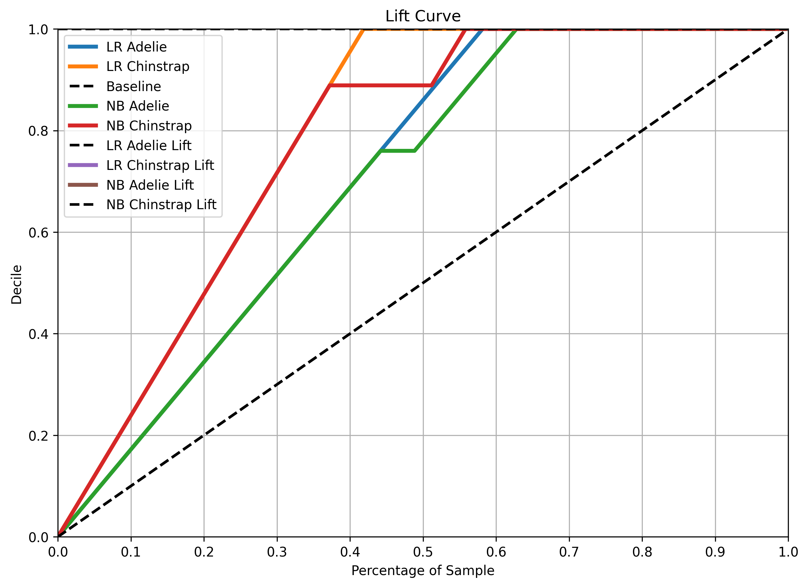
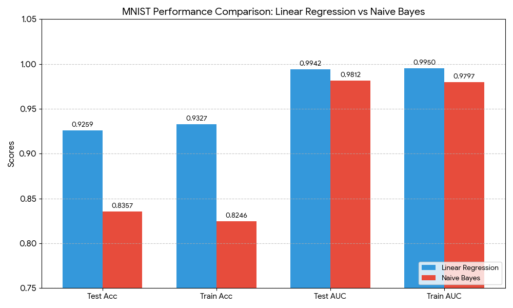

# CS552_Assignment2_PenguinsDataset
80/20 train test split for Penguins and MNIST datasets
MNIST dataset used all of the digits for performance evaluation

## Penguins Dataset Results
### Accuracy Comparison

The logistic regression (LR) accuracy is 100% while the Naive Bayes (NB) is 95.35%. The LR accuracy suggests that the model found a perfect line of fit meaning meaning that the model is highly overfit to this specific dataset. The NB accuracy is reflective of the algorithm considering each feature as independent from the rest. 

### AUC Comparison

  
| Algorithm               | Train |        Test |
| -----------             | ----------- |----------- |
| Logistic Regression     | 0.9997       |1.0000
| Naive Bayes             | 0.9769       |0.9733

For both of the algorithm and both of the dataset, the AUC is near perfect meaning that the two selected classes are nearly perfectly seperated from one another making identification relatively easy. Overall, the LR model is more effective, however, the NB model has a great chance of generalization when new samples are classified.

### Lift and Gain Chart

Based on the chart, the models perform identically with the exception of the following regions. For the 'Chinstrap' species, the deviation happens around 38-55% of the data. In that interval, the LR model continues to increase it's performance while the NB model stabilies before it increases it's performance closer to LR in the region of 55% of the data. Past 60% of the data, both models perform equally well. Prior to 40% of the data threshold, the models increase at a consistent rate with one another. 

For the 'Adelie' species, the main deviation happens around 45-63% of the data. Similar to the model performance for the 'Chinstrap', LR model continues to grow at a consistent rate while NB model stabilizes before continuing to grow. Past 65%, both of the algorithms perform equally well on both of the species. 

In comparisson to the baseline, both models increase their performance at a constant rate and completely stabilize after 65% of the data is used. The baseline, on the other hand, constantly increases at a lower rate without ever reaching perfect performance. 

### Model Performance Comparision
Based on all the metrics evaluations, this dataset can be considered perfectly adjusted to algorithm training/testing. The extremely high accuracy scores for both algorithms suggest that they were able to find perfect or near perfect fits for the data. Due to the near perfect for for the training and testing data, neither of these algorithms would generalize too well. However, NB model would be a better choice shall this dataset be extended since it naturally introduced a little bit of error into its predictions based on the independence assumption.

Overall, the gains chart reflects a similar idea about the dataset being perfrectly set up and cleaned. One interesting thing to note is the small constant performance of the NB model around the region of 45%. Such an observation can be explained by how each additional data point affects the probabilities computed. It is possible that shuffling the data or picking a different ratio for the train test split would remove this phenomenon.

## MNIST Dataset Results
Note: Used Keras for opening and processing the dataset and logistic regression
### Accuracy and AUC Comparison
The accuracy and AUC per digit are provided in detail below for each of the algorithms in addition to the summary metrics. Note that the image below was generated using Gemini.

  
|Model           | Train Acc | Test Acc | Train AUC | Test AUC|
|-----------------|-----------|----------|-----------|--------|
Linear Regression | 0.9327   | 0.9259   | 0.9950   | 0.9942
Naive Bayes     | 0.8246   | 0.8357   | 0.9797   | 0.9812

#### Logistic Regression

  
|Digit  | Train Acc_LR  | Test Acc_LR   | Train AUC_LR  | Test AUC_LR |
|-------|------------|------------|------------|--------|
0      | 0.973      | 0.978      | 0.9989     | 0.9991
1      | 0.972      | 0.975      | 0.9989     | 0.9986
2      | 0.916      | 0.902      | 0.9910     | 0.9885
3      | 0.899      | 0.906      | 0.9921     | 0.9937
4      | 0.931      | 0.918      | 0.9963     | 0.9960
5      | 0.882      | 0.868      | 0.9911     | 0.9897
6      | 0.977      | 0.969      | 0.9989     | 0.9982
7      | 0.953      | 0.935      | 0.9966     | 0.9939
8      | 0.911      | 0.897      | 0.9925     | 0.9895
9      | 0.908      | 0.908      | 0.9937     | 0.9925

#### Naive Bayes

  
|Digit  | Train Acc_NB  | Test Acc_NB   | Train AUC_NB  | Test AUC_NB  |
|-------|------------|-----------|------------|----------|
0      | 0.905      | 0.931      | 0.9935     | 0.9964
1      | 0.936      | 0.935      | 0.9936     | 0.9956
2      | 0.828      | 0.831      | 0.9820     | 0.9815
3      | 0.808      | 0.844      | 0.9733     | 0.9788
4      | 0.742      | 0.744      | 0.9831     | 0.9829
5      | 0.661      | 0.657      | 0.9672     | 0.9694
6      | 0.914      | 0.897      | 0.9917     | 0.9921
7      | 0.822      | 0.838      | 0.9889     | 0.9839
8      | 0.770      | 0.797      | 0.9533     | 0.9596
9      | 0.828      | 0.853      | 0.9702     | 0.9722

### Lift and Gain Charts for Each Digit
Note: 0 class is the likelihood that the digit is NOT the digit of interest

  
  

  
  

  
  

  
  

  
  

  
  

  
  

  
  

### Model Performance Comparision
Based on the results collected above, LR model outperforms the NB model for digit identification from images. The LR model learns the weight of each pixel while the NB model learns the frequencies of each pixel meaning that LR has more spacial awarness in comparisson to NB. For both of the models, the AUC is significantly higher than the accuracy meaning that the models correctly identified the correct digit as one of the top possibilities. The gap between metrics for both of the algorithms is very small suggesting that both of the models are not overfit and thus will generalize well. 

Based on the individual gains charts, the performance is nearly identical for each of the digit suggesting that the data set is well balanced in the number of sampels per each digit. Moreover, past 50% of the data used, each model displayed perfect performance. Finally, the likelihood that the digit is NOT the digit of interest steadily increased as the number of samples increased.
